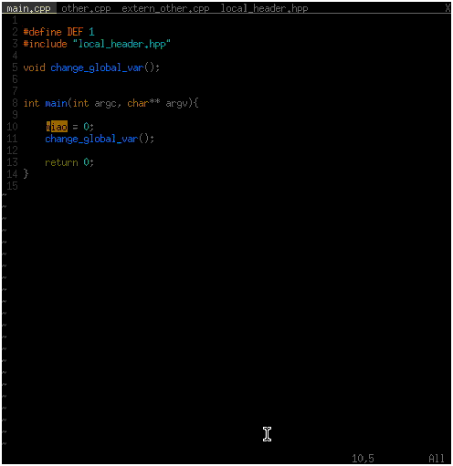

clang-refactor 
==============

This is a refactor for C and C++ programs based on clang-modernize and oclint rules.

In order to get refactoring for c++, I started to implement some basic refactorings.
I can not garantee that these will not break your code, so use version control.
The refactor is intended to be usable as a stand alone application,
but can be integrated into editors by very simple plugins. 

I already wrote a plugin for vim
[vim-clang-refactor](https://github.com/realincubus/vim-clang-refactor)

### Installation

For building clang-refactor you need a stable llvm+clang+extra-tools build.
[clang getting started](http://clang.llvm.org/get_started.html)

In a stable llvm+clang+extra-tools build do
```sh
git clone https://github.com/realincubus/clang-refactor.git ${LLVM_ROOT}/tools/clang/tools/extra/clang-refactor
``` 

and add `add_subdirectory(clang-refactor)` to `${LLVM_ROOT}/tools/clang/tools/extra/CMakeLists.txt`
this will add the refactor to the build chain.

Now go to `${LLVM_BUILD_DIR}` and run make ( to speed it up `make -j ${number_of_threads}` )
the executable will go to `${LLVM_BUILD_DIR}/bin`.

I did not try, but running `sudo make install` should install this on your system.
If you did not install, remember to put `${LLVM_BUILD_DIR}/bin` into your PATH.

#### Using the systems installation of clang
If a recent clang or llvm is installed one can now compile clang-refactor without the need to have a llvm+clang+extratools tree.
Checkout the standalone branch of this repos and run cmake.

Tested on 
  - Gentoo (clang 3.5.0)


### Project Setup

Just as clang-modernize the program needs a compile_commands.json file.
The easiest way to generate one is to use cmake.
Simply add `SET(CMAKE_EXPORT_COMPILE_COMMANDS ON)` to your CMakeLists.txt

### Refactorings

you can get a list of available transformations from clang-refactor with `clang-refactor -help`

-  -collapse-ifstmt              - merges if statements which include other if statements
-  -extract-method               - fill in
-  -from-zero                    - fill in
-  -local-iterator               - transforms int i; for( i = 0 ; i < 10 ; i++ ) to for( int i = 0; i < 10 ; i++) 
-  -move-to-firstuse             - fill in
-  -nested-index                 - finds nested indexes and renames them to avoid naming conflicts
-  -pull-temporaries             - fill in
-  -remove-identity-ops          - removes a (*|/) 1 a (+|-) 0
-  -remove-redundant-conditional - replaces expressions like a>b ? true : false with a > b 
-  -rename-variable              - renames a variable 
-  -repair-broken-nullcheck      - replairs checks like if ( a->fun() && a ) 
-  -unglobal-method              - fill in
-  -uninvert-logic               - inverts if statements with != 
-  -use-algorithms               - fill in
-  -use-compound                 - translates expressions like b = b + 1 to b += 1 
-  -use-const                    - will add const to the type if the variable was never written to
-  -use-emplace                  - fill in
-  -use-empty                    - transforms vec.size() == 0 to vec.empty()
-  -use-hypot                    - translates sqrt( pow(a,2) + pow(b,2) ) to hypot( a, b ) 
-  -use-math-constants           - replaces magic numbers like 3.14159... with M_PI 
-  -use-pow                      - uses power operator instead of a * a
-  -use-raii                     - fill in
-  -use-round                    - replaces int( 0.5 + var ) with round
-  -use-std-array                - converts int a[100] to std::array<int,100> a;
-  -use-swap                     - finds the three line swap and replaces this with std::swap
-  -use-unary-operators          - transforms b += 1 to ++b
-  -use-vector                   - fill in

The transformations do some checks but the checks are not perfect so 
they can possibly transform code and change semantics! 
If you already use some version control system commit your changes befor using the refactor,
so you can get back to the original state.


### Usage

#### Single file
To run a refactoring on a file, go to the directory and run 
```sh
clang-refactor -use-pow main.cpp
```
This will transform all occurences of something like (a*b*c)*(a*b*c) to pow(a*b*c,2).

If you wish to apply the transformation just to some specific range of lines add the lines flag

```sh
clang-refactor -use-pow -lines=10-1:20-2 main.cpp
```

#### Multiple files

If you want to apply a transformation to the whole list of files in the compile_commands.json file,
do it like this:

```sh
clang-refactor -use-pow -p ${PATH_TO_COMPILE_COMMANDS_FILE} \
-include ${FOLDER_TO_INLCUDE} -exclude ${FOLDER_TO_EXCLUDE} 
```

Use include an exclude to specify folders with files that can be changed 
and folders with files that must not be changed. This is nessicary since the compile_commands.json file
does not contain information about headers.

### Future plans

This repository is the central part of a refactor but it needs some ui integration. 
I already have a plugin for vim that passes the selected transfrom and lines to the refactor,
but it would be nice to get some hints from the compiler to vim on where a transformation can be applied.

Some plugins for vim like Syntastic and YouCompleteMe already show clangs errors and warnings.
So one possible way is to add some custom warnings to clang so that these plugins could display them.
But i dont want to change the compilers semantic analysis code, since this is nothing one can switch on and off.
It would be better to write a plugin for clang.
I know one can to this but i already tested and the warnings and errors produced by plugins dont show up in 
Syntastic and YouCompleteMe.


